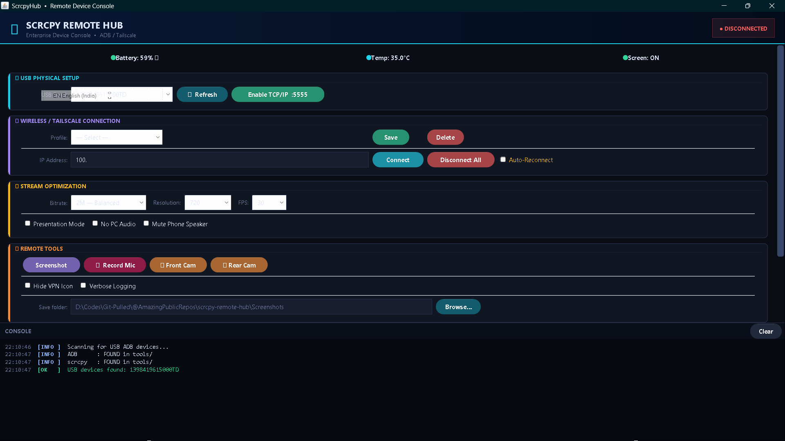
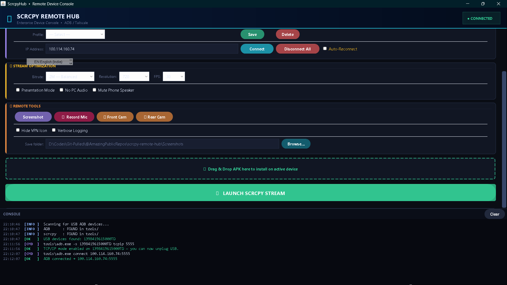
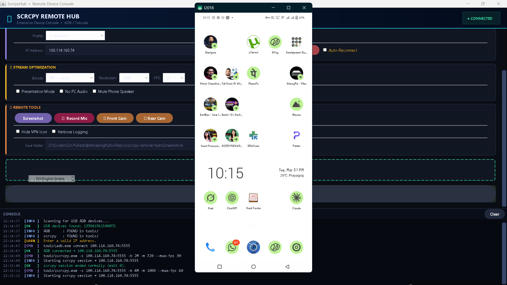

# Scrcpy Remote Hub

### (Access Your Mobile Remotely without Touch)

Control your Android device from anywhere in the world! **Scrcpy Remote Hub** is a premium, automated command center featuring a sleek dark-mode UI.

**Core Capabilities:**

- **Mirror the phone** seamlessly over Wi-Fi or global VPN.

- **Stealth screenshot** and front/rear camera snaps without waking the device.

- **Vital monitor** for real-time tracking of battery percentage, temp, and screen state.

- **Silently install APK** files via simple drag-and-drop.

- **Covert audio capture** to record the device's microphone directly to your PC.

- **Notification Sync** to push phone alerts directly to your Windows desktop.

---

## SCREENSHOT

## 1. The Prep Work

Before launching, you need two basic things:

1. **Phone:** Go to Settings > Developer Options and enable **USB Debugging**.
2. **PC:** Ensure **Java** (JDK 8+) is installed and added to your system's PATH.

## 🛠️ 2. Installation

Forget manual downloads. We made this 100% automated:

1. Download or clone this project folder.
2. Double-click **`run_hub.bat`**.
3. Press `Y` when prompted. The script will automatically download the official Scrcpy binaries, build your workspace, and launch the Hub!

---

## 🌍 3. Global Access (Tailscale Setup)

Want to leave your phone at home and control it from the office? You need to put both devices on the same virtual network.

1. **Create an Account:** Go to [Tailscale.com](https://tailscale.com/) and sign up for free.
2. **Install on PC:** Download the Windows app, install it, and log in.
3. **Install on Phone:** Download the Tailscale app from the Google Play Store.
4. **Connect:** Log into the phone app with the _exact same account_ and toggle the VPN switch to **Active**.
5. **Get your IP:** Look at the top of the Tailscale app on your phone. You will see an IP address starting with `100.x.x.x`. Save this number—this is your magic key for remote access!

---

## 🔗 4. How to Connect

### Phase 1: The USB Handshake (One-Time)

Android requires a physical connection _once_ to unlock wireless debugging.

1. Plug your phone into your PC via USB. _(Check "Always allow" on your phone screen if prompted)._
2. On the Hub, click **[Refresh]** under USB Physical Setup.
3. Click the green **[Enable Wireless]** button.
4. Check the console. Once it says successful, **unplug the USB cable**.

### Phase 2: Wireless Control

1. Enter your phone's IP address (Use your Local Wi-Fi IP if in the same room, or your new **Tailscale 100.x.x.x IP** for global access).
2. Click **[Save]** so you don't have to type it next time.
3. Click **[Connect]**. The status will change to **🟢 CONNECTED**.
4. Adjust your stream quality and click **LAUNCH SCRCPY STREAM**!
